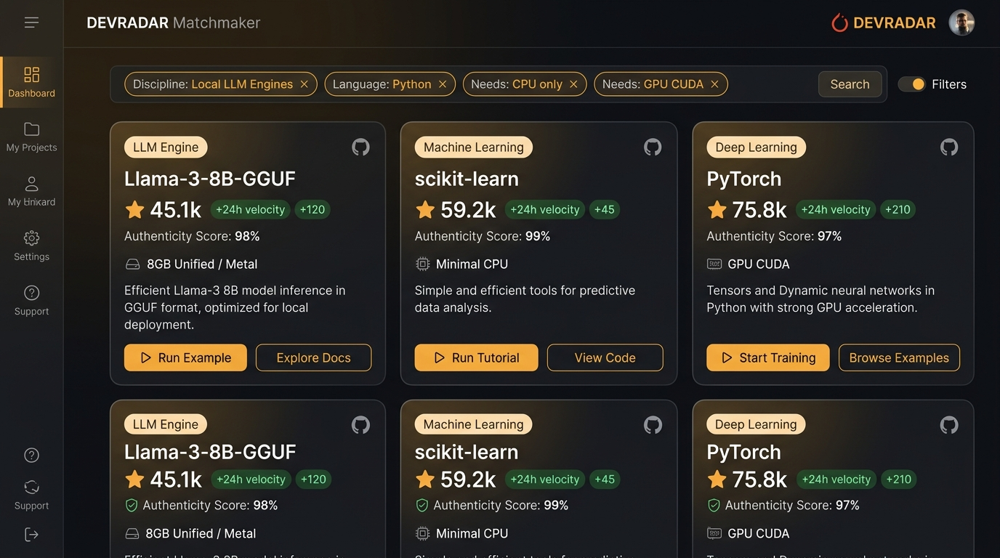
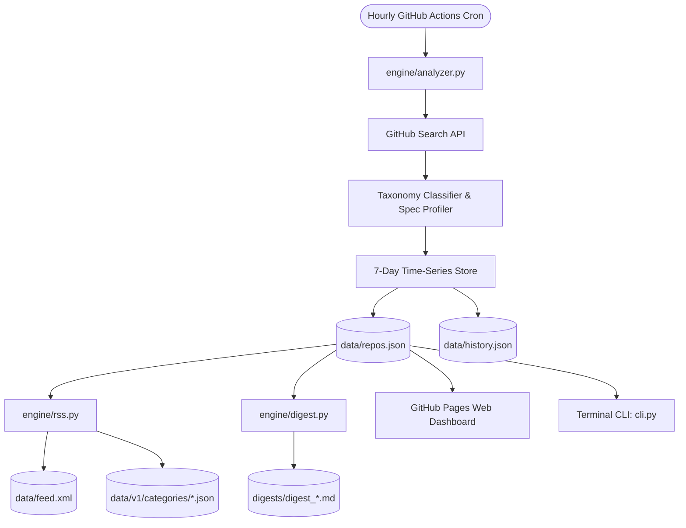

# 🛰️ DevRadar // Breakout Open-Source Pulse

[](https://siddharthakki.github.io/devradar/)
[](https://github.com/siddharthakki/devradar/actions/workflows/radar-engine.yml)
[](https://github.com/siddharthakki/devradar/actions/workflows/pages-deploy.yml)
[](https://siddharthakki.github.io/devradar/data/feed.xml)
[](LICENSE)

> **Autonomous open-source intelligence separating genuine architectural momentum from bot-manipulated hype.** Query breakout GitHub projects by architectural intent, hardware floor viability, and organic authenticity scores.

---

## 📸 Dashboard Preview



*Interactive visual dashboard tracking high-velocity open-source repositories with real-time 24h momentum, anti-bot authenticity metrics, and hardware requirements.*

---

## ⚡ The Problem DevRadar Solves

Standard open-source discovery is broken:
1. **GitHub Trending is gamed:** Coordinated star-farming, corporate repos with 80,000 legacy stars, and PR wrapper hype drown out genuine breakthroughs.
2. **Reddit & Hacker News are ephemeral:** If you miss a trending post on `r/LocalLLaMA` or HN on Thursday afternoon, you miss the tool entirely.
3. **Awesome lists rot:** They don't tell you if the maintainer abandoned the codebase two months ago or if the model requires 24GB of CUDA VRAM.

**DevRadar is a 100% serverless, zero-maintenance discovery engine** that ingests, scores, classifies, and publishes breakout tools every hour on GitHub Actions and GitHub Pages.

---

## ✨ Key Features

* 🧠 **AI Stack Advisor (Powered by Puter.js):** Zero-friction, free client-side AI consultant directly inside the dashboard. Ask questions like *"I need a local offline agent with tool calling on an RTX 3060"* and receive structured architectural trade-offs and tool recommendations.
* ⚖️ **Architectural Verdicts & Gotchas:** Every tool card features a concise 1-sentence engineering assessment and realistic gotchas (VRAM ceilings, API shifts, stability warnings).
* 🖥️ **Hardware Floor Profiling:** Know before you clone whether a tool needs **Minimal CPU**, **8GB Unified Apple Silicon (Metal)**, or **16–24GB+ CUDA VRAM**.
* 🛡️ **Anti-Hype Authenticity Index:** Flags abnormal star surges using fork-to-star balance ratios and momentum deviation to weed out star farms.
* 🚀 **Gravity-Decay Momentum Scoring:** Prioritizes repositories displaying rapid adoption over their first 7 to 30 days while dampening dormant behemoths:
  $$\text{Score} = \frac{\text{Stars}}{(\text{Age\_Hours} + 2.0)^{1.25}}$$
* 🧩 **20 High-Signal Disciplines:** Categorizes projects across Local LLM Engines, Multi-Agent Frameworks, RAG, CRDTs, TUI Tools, Embedded AI, Vector Databases, and more.
* 💬 **Natural Language Querying:** Query directly using phrases like *"local-first llm engine without gpu in rust"* or use instant filter chips (`lang:python`, `needs:gpu`, `needs:mcp`).
* 📡 **Static API Slices & RSS 2.0:** All data is published hourly to flat JSON endpoints and an RSS 2.0 feed for seamless ingestion into Feedly, Miniflux, or custom bots.
* 💻 **Terminal CLI:** Query the live leaderboard directly from your command line without opening a browser.

---

## 🔄 Autonomous Pipeline Architecture

DevRadar operates with **$0 infrastructure overhead**, running on GitHub Actions cron and hosted on GitHub Pages:



---

## 💻 Terminal CLI Client

DevRadar includes a zero-dependency terminal client to inspect live breakout repositories right from your shell:

```bash
# Display top 10 breakout projects across all disciplines
python cli.py --top 10

# Filter by specific category
python cli.py --top 5 --category "Local LLM Engines"
python cli.py --top 5 --category "Multi-Agent Frameworks"
```

### Sample Output:
```text
🛰️  DEVRADAR — BREAKOUT OPEN-SOURCE LEADERBOARD

Stars      24h Velocity   Authenticity   Repository                          Specs
------------------------------------------------------------------------------------------
⭐ 3,783    +45 24h        🛡️ 95%         raullenchai/Rapid-MLX               8GB Unified / Metal
⭐ 128,702  +210 24h       🛡️ 95%         ggml-org/llama.cpp                  8GB Unified / Metal
⭐ 9,388    +12 24h        🛡️ 95%         oumi-ai/oumi                        Minimal CPU
⭐ 5,510    +18 24h        🛡️ 95%         Blaizzy/mlx-vlm                     Minimal CPU
⭐ 210      +8 24h         🛡️ 95%         defilantech/LLMKube                 8GB Unified / Metal

Explore full visual dashboard: https://siddharthakki.github.io/devradar/
```

---

## 📡 Static API & Feed Endpoints

All data generated by DevRadar is distributed via static endpoints:

| Endpoint | Description |
| :--- | :--- |
| `https://siddharthakki.github.io/devradar/data/repos.json` | Complete enriched repository catalog with capabilities, health, and 24h velocity. |
| `https://siddharthakki.github.io/devradar/data/feed.xml` | Standard RSS 2.0 feed of top 15 trending breakout tools. |
| `https://siddharthakki.github.io/devradar/data/v1/meta.json` | API index and metadata. |
| `https://siddharthakki.github.io/devradar/data/v1/categories/<slug>.json` | Category-specific JSON slices (e.g. `local-llm-engines.json`, `multi-agent-frameworks.json`). |
| `https://siddharthakki.github.io/devradar/digests/` | Markdown archives of weekly curated radars. |

---

## 🛠️ Local Development & Testing

### 1. Prerequisites
* Python 3.11+
* Git

### 2. Setup
```bash
# Clone the repository
git clone https://github.com/siddharthakki/devradar.git
cd devradar

# Install dependencies
pip install -r engine/requirements.txt
```

### 3. Run Test Suite
```bash
pytest tests/ -v
```

### 4. Run Pipeline Locally
```bash
# (Optional) Export your GitHub Token to avoid unauthenticated API rate limits
export GITHUB_TOKEN="ghp_your_token_here"

# 1. Ingest, analyze & categorize repositories
python engine/analyzer.py

# 2. Generate RSS feed & category API endpoints
python engine/rss.py

# 3. Generate weekly Markdown digest
python engine/digest.py
```

### 5. Serve Web Dashboard Locally
```bash
python -m http.server 8000
# Open http://localhost:8000 in your browser
```

---

## 📜 License

Distributed under the **MIT License**. See [LICENSE](LICENSE) for details.